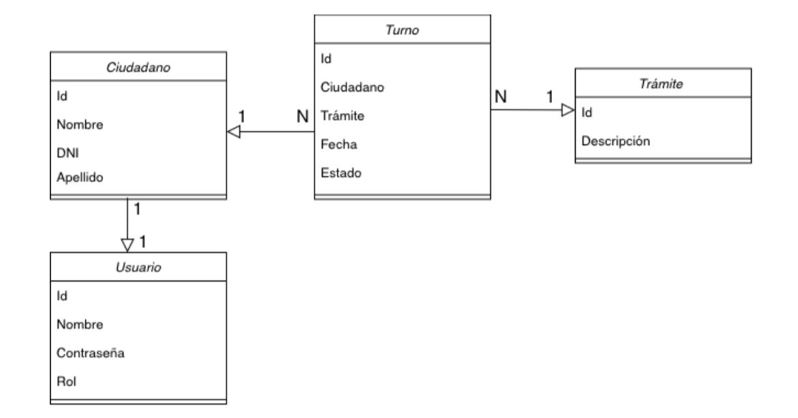

## Sistema de Gestión de turnos

Sistema diseñado para la administración de turnos en una entidad gubernamental. Facilita el registro de ciudadanos junto con la creación de turnos para sus trámites correspondientes de manera eficiente. Además, proporciona una visualización de todos los turnos con opciones de filtrado por fecha y estado (En espera / Atendido).

## Modelado de Clases

### FUNCIONALIDADES PRINCIPALES

#### Registro
- Permite la creación de un perfil de ciudadano junto con su usuario correspondiente para acceder a la aplicación.
- Se evita el crear un ciudadano duplicado al pedir el DNI al usuario

#### Creación turno
- Facilita la creación de turnos, permitiendo al usuario elegir la fecha, el trámite disponible en la base de datos y el ciudadano asociado.

#### Visualicación de los turnos

- Ofrece una vista completa de todos los turnos, con la posibilidad de filtrarlos por fecha y estado.

#### Edición estado turno (Admin)
- Proporciona al administrador la capacidad de modificar el estado de cualquier turno según sea necesario (En espera / Atendido).

### REQUISITOS
Para ejecutar este proyecto, necesitarás:

- **JDK:** Es necesario tener instalado Java Development Kit versión 17 o superior.
- **BBDD:**
    - Se proporciona un archivo `gestor_turnos.sql` que contiene la estructura de la base de datos.
    - Se necesita un gestor de MySQL (phpMyAdmin, Workbench, etc.).
- **IDE:**
    - Utilizar un entorno de desarrollo integrado compatible (Netbeans).

- Apache Maven

### SUPUESTOS

- Se ha creado un **login** con dos posibles tipos de usuario (Admin / Usuario Básico).
El **usuario básico** tiene acceso limitado para solicitar turnos y ver su historial.
El **administrador** tiene privilegios adicionales, incluida la capacidad de crear nuevos turnos con cualquier ciudadano, modificar el estado de los turnos y agregar nuevos ciudadanos a la base de datos con sus respectivos usuarios.

### LOGIN Y CONTRASEÑAS
- Para poder entrar a la aplicación, se puede entrar con:
    - *Usuario Básico*
        - DNI: 12345678G
        - Contraseña: 123
    - *Admin*
        - DNI: 87654321L
        - Contraseña: 123
